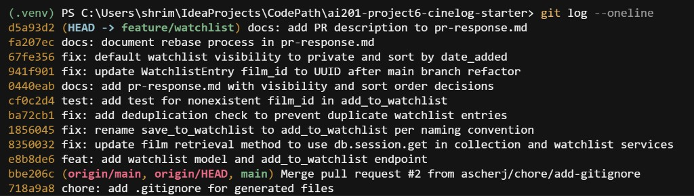

# PR Response Doc - CineLog Watchlist Feature

## AI Usage

I used AI tools at several points during this project, but verified everything against the actual codebase before committing.

**Orientation (Milestone 1):** I asked the AI to summarize how `models.py`, `collection_service.py`, and `test_collection.py` fit together — naming conventions (`verb_to_noun`), deduplication via `filter_by` + `.first()`, and the pytest fixture pattern. That helped me read the starter code faster, but I still opened each file myself before writing watchlist changes.

**Comment 2 — deduplication design:** After implementing duplicate rejection (mirroring `add_to_collection()`), I asked whether users should be allowed to re-add films instead of raising an exception. The AI outlined alternatives: reject with 409 (current collection pattern), idempotent return, or upsert/bump `date_added`. I kept the 409 approach because it matches existing CineLog behavior and directly answers the reviewer's "handle this case" comment — but I noted in my reasoning that "bump on re-add" would be a valid product choice if recency mattered more than strict uniqueness.

**Comments 4 and 5 — devil's advocate:** I used the assignment's suggested prompt style: *"What counterargument would a careful reviewer raise? What tradeoff am I not acknowledging?"*

- For **visibility**, the AI argued convincingly for `public=True` (friend discovery, lower friction for movie-night planning). I incorporated that as my "Tradeoff acknowledged" section but kept `public=False` because watchlists express *intent* rather than completed logs, and the asymmetry of accidental exposure outweighs the sharing friction — especially with no `public` param on the add endpoint yet.
- For **sort order**, the AI agreed with the reviewer's recency argument and added the engagement angle (recent saves stay top-of-mind). It also surfaced the legitimate case for alphabetical lookup in long lists; I addressed that by proposing a future `?sort=title` param rather than keeping A–Z as the default.

**Git workflow:** I used AI to understand why `git status` did not show my rename after committing (changes were already in history, not the working tree) and to diagnose a fork setup issue — I had forked with "Copy the main branch only" checked, so `feature/watchlist` was missing from my remote until I re-forked with all branches. I verified branch names with `gh api` and `git branch -a` rather than trusting the explanation alone.

**What I did not delegate:** The actual code changes (rename, dedup, test), commit messages, and final wording in this document. I ran `pytest tests/ -v` myself after every M2 change.

## Comment 1 - Rename
**What I did:**

Renamed `save_to_watchlist()` to `add_to_watchlist()` in `services/watchlist_service.py` to match the project's `verb_to_noun` convention (`add_to_collection()`, `remove_from_collection()`). Updated the import and call site in `routes/watchlist/watchlist.py` (`add_film` handler).

**How I verified:**

Searched the repo for `save_to_watchlist` — no remaining references. Ran `pytest tests/ -v` to confirm nothing broke.

## Comment 2 - Deduplication
**What I did:**

Read `add_to_collection()` in `services/collection_service.py` and mirrored its pattern in `add_to_watchlist()`: query for an existing `WatchlistEntry` with the same `user_id` and `film_id` before inserting, and raise `AlreadyInWatchlistError` if found. Added the exception class and a `409` handler in `routes/watchlist/watchlist.py`, matching the collection route's `AlreadyInCollectionError` handling.

**How I verified:**

Manually traced the logic against `add_to_collection()` — same check (`filter_by` + `.first()`), same raise-before-insert order. Ran `pytest tests/ -v` — all tests pass.

## Comment 3 - Missing test
**What I did:**

Created `tests/test_watchlist.py` modeled on `test_add_to_collection_nonexistent_film_raises` in `tests/test_collection.py` — same `app` / `sample_user` fixture pattern, same fake UUID (`00000000-0000-0000-0000-000000000000`), same `pytest.raises(FilmNotFoundError)` assertion.

**How I verified:**

```bash
pytest tests/test_watchlist.py -v
pytest tests/ -v
```

Both pass (5 tests total).

## Comment 4 - Default visibility
**My position:**

Change the default to `public=False`. A watchlist is forward-looking and personal — it reveals what someone *plans* to watch, not what they've chosen to log and share. Privacy should be the default; users can opt in to visibility when they want social discovery.

**Reasoning:**

CineLog is described as a community app, but the two features serve different social purposes:

- **Collection** (films already watched) is an act of logging — users have already made a choice to engage with a film and may expect that log to be part of their public film identity.
- **Watchlist** (films saved for later) is closer to a private queue. Someone might save a guilty-pleasure film, a documentary on a sensitive topic, or a recommendation they're not ready to discuss yet. Defaulting to `public=True` exposes that intent before the user has decided to share it.

`public=False` optimizes for **user trust on first use**: a new user can build a watchlist without worrying that every save is immediately visible. This follows a common pattern in social apps — private by default for "intent" data, public when the user publishes an outcome.

**Tradeoff acknowledged:**

The counterargument for `public=True` is real and worth naming. If CineLog's primary goal is **active community engagement between close contacts** — friends discovering what each other wants to watch and planning movie nights — then a public default lowers friction. Friends could browse each other's watchlists without every user having to remember to toggle visibility on. A public default optimizes for **discovery and serendipity** over privacy.

I considered that tradeoff and still favor `public=False` because:

1. **Asymmetry of harm** — a user who wanted privacy but got public-by-default may feel exposed; a user who wanted sharing can flip one toggle (or we add an explicit `public` param on `POST /watchlist/<user_id>/add` as a stretch feature). The privacy mistake is harder to undo socially than the sharing omission is to fix technically.
2. **No visibility toggle on the endpoint yet** — without an API parameter to set `public` at add-time, inheriting `default=True` from the model means every caller gets public with no choice. That makes the default especially important to get right.
3. **Collection already carries the social signal** — watched-and-rated films are the natural "here's my taste" surface; watchlists don't need to duplicate that role by default.

If the product direction shifts toward friend-group discovery as the core loop, I'd revisit this — but for a general community platform, intentional sharing beats inherited visibility.

## Comment 5 - Sort order
**My position:**

Agree with the reviewer — sort by `date_added` descending (newest first), not `Film.title` alphabetically. This matches `get_collection()` in `services/collection_service.py`, which already uses `.order_by(CollectionEntry.date_added.desc())`.

**Reasoning:**

A watchlist is a **time-ordered queue of intent**, not a catalog. When a user opens their watchlist, the most relevant question is usually *"what did I save recently?"* — a friend just recommended a film, they saw a trailer, they were browsing last night. Temporal ordering surfaces those entries at the top without the user having to scan an A–Z list.

Alphabetical order optimizes for **lookup by title** ("where is *Parasite* in my list?"), which matters more for large, stable libraries — like a film database or a completed collection you've accumulated over years. Watchlists are smaller, more fluid, and constantly changing; recency is a better default sort key.

Sorting by `date_added` also keeps watchlist behavior **consistent with collection behavior** on the same platform. Users who learn that collections show newest-first will reasonably expect watchlists to work the same way, reducing cognitive load.

**Engagement with reviewer's point:**

The reviewer said most users want to see what they added recently — I agree, and I'd add that recency-based ordering may support engagement directly: the films at the top of the list are the ones most likely to still be top-of-mind, making a user more likely to act on them (watch, share, discuss) rather than abandoning a alphabetically-sorted list where today's saves are buried mid-queue.

**Counterargument considered:**

Alphabetical sorting has a legitimate use case: a user with a long-standing watchlist of 50+ films who wants to check whether a specific title is already saved. A–Z makes that scan predictable. But that's a **search/find problem**, and it's better solved by a dedicated search or filter endpoint later — not by making alphabetical the default for every user on every load. For the default view, recency matches how watchlists are actually used day to day.

If we wanted to support both, a `?sort=title` query parameter could offer alphabetical as an opt-in — but the default should be `date_added desc`.

## Comment 6 - Rebase
**What conflicted:**

`.gitignore` — add/add conflict during rebase. Both `main` and my `chore: add gitignore` commit added the same file. `main` included `.pytest_cache/`; my version did not.

After rebase completed, `WatchlistEntry` was missing from `models.py` — the starter's bootstrap commit never modified `models.py`, so replaying onto UUID `main` left watchlist service/routes pointing at a model that did not exist. Watchlist code also still documented integer `film_id` in places.

**How I resolved it:**

```bash
git add pr-response.md && git commit -m "docs: complete AI usage section in pr-response.md"
git rebase origin/main
# Resolved .gitignore: kept both .pytest_cache/ (from main) and .venv/ entries (from mine)
git add .gitignore && git rebase --continue
# Added WatchlistEntry to models.py with String(36) film_id FK (UUID)
# Updated watchlist_service docstring and route to use UUID film_id
git commit -m "fix: update WatchlistEntry film_id to UUID after main branch refactor"
# Applied documented design decisions from Comments 4 and 5
git commit -m "fix: default watchlist visibility to private and sort by date_added"
```

**How I verified no conflict remains:**

1. `git status` — clean working tree after rebase and fix commits.
2. `git log --oneline origin/main..HEAD` — linear history, no merge commits.
3. Grep — `WatchlistEntry.film_id` is `String(36)`; no integer `film_id` in watchlist code.
4. `pytest tests/ -v` — all tests pass.
5. No conflict markers (`<<<<<<<`) in any file.

## PR Description

**What the feature does:**

This PR adds a watchlist feature to CineLog so users can save films they plan to watch later. It introduces a `WatchlistEntry` model, `add_to_watchlist()` and `get_watchlist()` service functions, and two REST endpoints: `GET /watchlist/<user_id>` to view a user's watchlist and `POST /watchlist/<user_id>/add` to save a film. The PR also addresses all six maintainer review comments: function rename, duplicate prevention, missing test, visibility default, sort order, and UUID compatibility after rebasing onto `main`.

**Design decisions:**

1. **Visibility default (`public=False`):** New watchlist entries default to private. A watchlist reflects what someone *intends* to watch, not what they have already logged and chosen to share. Privacy-first avoids exposing viewing intent before the user opts in. The tradeoff is slightly more friction for friend discovery — users who want a public queue must toggle visibility explicitly (a future enhancement).

2. **Sort order (`date_added` descending):** Watchlists return newest saves first, matching `get_collection()` behavior on the same platform. Recency is more useful for a fluid, frequently updated queue than alphabetical title order, which better suits large stable catalogs. Users who want A–Z lookup could use a future `?sort=title` parameter.

**Manual testing steps:**

1. **Setup**
   ```bash
   pip install -r requirements.txt
   python app.py
   ```
   Server runs at `http://localhost:5000`.

2. **Create test data** — Use existing endpoints or the SQLite DB to ensure you have a valid `user_id` (UUID) and `film_id` (UUID). Example: list films with `GET /films/` and note a film's `id`.

3. **Add a film to the watchlist**
   ```bash
   curl -X POST http://localhost:5000/watchlist/<user_id>/add \
     -H "Content-Type: application/json" \
     -d "{\"film_id\": \"<valid-film-uuid>\"}"
   ```
   **Expected:** `201` with JSON containing `film_id`, `date_added`, and `"public": false`.

4. **View the watchlist**
   ```bash
   curl http://localhost:5000/watchlist/<user_id>
   ```
   **Expected:** JSON array of films; most recently added film appears first.

5. **Test duplicate prevention** — Repeat the same `POST` from step 3.
   **Expected:** `409` with an error message (film already on watchlist).

6. **Test nonexistent film** — `POST` with a fake UUID like `00000000-0000-0000-0000-000000000000`.
   **Expected:** `404` with an error message (film not found).

7. **Run automated tests**
   ```bash
   pytest tests/ -v
   ```
   **Expected:** 5 tests pass (4 collection + 1 watchlist).

## Git Log

Screenshot of `git log --oneline origin/main..HEAD` after M4 history cleanup — 10 conventional commits, no merge commits:


